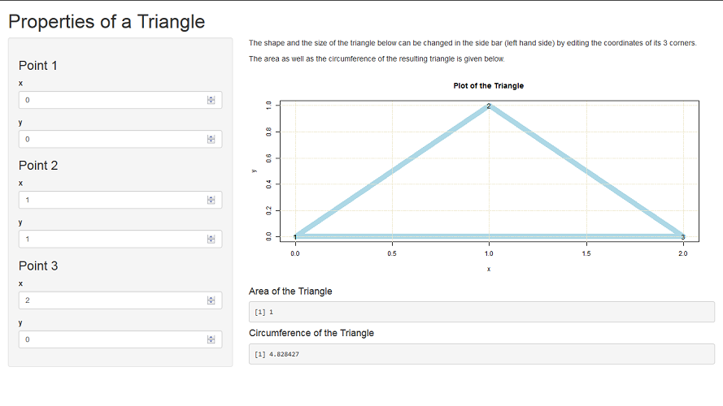

## Introduction and Overview

#### Introduction

* This slidify documentation gives a description and instructions for use of the shiny application "Triangle", which was created for the peer review assignment of the course "Developing Data Products" as part of the "Data Science Specialisation" by Johns Hopkins University on Coursera. 

#### Overview

* The shiny application "Triangle" allows for defining and changing the size and the shape of a triangle interactively by editing the coordinates of its three corners. 

* Accordingly the triangle is plotted and both the area as well as the circumference of the triangle are calculated interactively. 

A screenshot as well as a description of the shiny app "Triangle" is given on slide 3. The mathematical background of the calculations are given on slide 4, and an example is shown on slide 5.

---

## Overview and Screenshot

The following picture shows a screenshot of the shiny application "Triangle":



* In the side panel on the left hand side the coordinates of the three corner points of the triangle, which is plotted on the right hand side, can be changed by the user.

* The area as well as the circumference of the triangle are given below the plot of the triangle.

---

## Mathematical Background

The area and the circumference of a triangle can easily be calculated using vector anylysis.

The three corners of the triangle are represented by three vectors: 

$$\small \vec{p_1} = (x_1, y_1),\: \vec{p_2} = (x_2, y_2),\: \vec{p_3} = (x_3, y_3)$$ 

The three vectors, which are directed from one corner towards the others, can be represented as follows: 

$$\small \vec{u} = \vec{p_2} - \vec{p_1},\: \vec{v} = \vec{p_3} - \vec{p_1},\: \vec{w} = \vec{p_3} - \vec{p_2}$$

The area **A** of the triangle can be calculated as follows:

$$\small A = \frac{1}{2} \cdot \vert \vec{u} \times \vec{v} \vert = \frac{1}{2} \cdot \vert u_x \cdot v_y - v_x \cdot u_y \vert$$

The circumference **C** of the triangle is given by 

$$\small  C = \vert u \vert + \vert v \vert + \vert w \vert$$ 

---

## Example (Triangle Area Calcualtion)

The following code chunk is part of the shiny server:

```{r}
Area <- function(x1, y1, x2, y2, x3, y3) {
    
    ux <- x2 - x1
    uy <- y2 - y1
    
    vx <- x3 - x1
    vy <- y3 - y1
    
    return(abs(ux * vy - vx * uy) / 2)
}

Area(0, 0, 1, 1, 2, 0)
```


